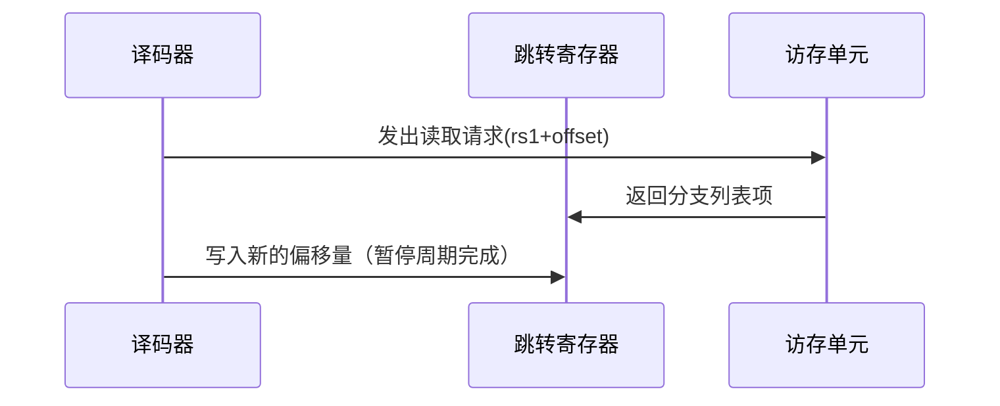

Qbit项目汇编API说明：

---
### **一、标准RISC-V核心指令**
#### 1. **U-Type（长立即数指令）**
| 指令 | 含义 | 格式 | 用途 | 示例 |
|------|------|------|------|------|
| `lui` | 加载高位立即数 | `lui rd, imm20` | 构造32位立即数的高20位 | `lui x5, 0x12345`（x5 = 0x12345000）|
| `auipc` | PC加立即数高位 | `auipc rd, imm20` | PC相对寻址，用于长跳转 | `auipc x6, 0x1000`（x6 = PC + 0x100000）|

#### 2. **J-Type（无条件跳转）**
| 指令 | 含义 | 格式 | 用途 | 编码特点 |
|------|------|------|------|------|
| `jal` | 跳转并链接 | `jal rd, offset` | 函数调用/长跳转 | 20位偏移（±1MB范围） |
| `jalr` | 间接跳转 | `jalr rd, offset(rs1)` | 通过寄存器跳转 | `jalr x1, 0(x5)` |

#### 3. **B-Type（条件分支）**
| 指令 | 功能 | 操作 | 用途 | 
|------|------|------|------|
| `beq`   | 相等跳转 | if (rs1 == rs2) PC += offset | 循环控制 |
| `bne`   | 不等跳转 | if (rs1 != rs2) PC += offset | 条件分支 |
| `blt`   | 有符号小于 | if (rs1 < rs2) PC += offset | 比较跳转 |
| `bge`   | 有符号大于等于 | if (rs1 ≥ rs2) PC += offset | 范围检查 |
| `bltu`  | 无符号小于 |  无符号版本   |  地址比较 |
| `bgeu`  | 无符号大于等于 | 无符号版本   | 缓冲区边界检查 |

#### 4. **Load/Store指令**
| 指令 | 数据类型 | 功能 | 示例 | 编码 |
|------|----------|------|------|------|
| `lw` | 32位字 | 加载字 | `lw x10, 4(x2)` | I-Type |
| `sw` | 32位字 | 存储字 | `sw x11, 8(x3)` | S-Type |

#### 5. **I-Type（立即数运算）**
| 指令 | 功能 | 运算规则 | 典型应用 |
|------|------|----------|----------|
| `addi`   | 加立即数 | rd = rs1 + imm | 算术运算/地址计算 |
| `slti`   | 有符号比较 | rd = (rs1 < imm) ? 1 : 0 | 逻辑判断 |
| `xori`   | 异或操作 | rd = rs1 ^ imm | 位操作 |
| `slli`   | 逻辑左移 | rd = rs1 << shamt | 位域操作 |

#### 6. **R-Type（寄存器运算）**
| 指令 | 功能 | 公式 | 相关字段 |
|------|------|------|----------|
| `add` | 加法 | rd = rs1 + rs2 | funct7=0 |
| `sub` | 减法 | rd = rs1 - rs2 | funct7=0x20 |
| `sll` | 逻辑左移 | rd = rs1 << rs2[4:0] | funct7=0 |
| `xor` | 异或 | rd = rs1 ^ rs2 | funct7=0 |

---

### **二、自定义指令**
#### 1. **读分支列表指令（LUJR）**
##### **指令格式与编码**
``` 
示例：0000B143 → LUJR x1, x2  
编码结构：
| rs1 | funct3 | rd | opcode |
|-----|--------|----|--------|
|     | 011    |    | 1000011|
```
**功能原理**：
  - 基地址寄存器：`rs1` → 存储分支列表基地址（指针）
  - 跳转寄存器：专用寄存器 → 存储当前偏移量（类似BHR分支历史寄存器）
  - 目标地址计算：`目标PC = rs1_value + 跳转寄存器值`
  - 访存操作：读取基地址处的分支列表项到跳转寄存器

##### **硬件实现需求**


#### 2. **用户寄存器读指令（LUW）**

增加⼀个读⽤户寄存器指令，可能会进⾏⼀些简单运算，或者直接进⾏存储，如⼏次结果进⾏逻辑运算
之后决定反馈得到之后的分⽀⾛向，因此就是将⽤户寄存器内容读⼊到通⽤寄存器当中即可。⽆需访存

opcode:1000111

| 特性 | 标准lw指令 | LUW指令 |
|------|------------|---------|
| 数据源 | 内存系统 | 用户寄存器文件 |
| 时延 | 3-5周期 | 1周期 |
| 用途 | 通用数据访问 | 控制流参数传递 |

#### 3. **用户寄存器写指令（SETUR）**

增加⼀个⽤户寄存器，寄存器写指令，对于需要修改，⽐如地址递增（可以想象成⼀个参数的数组，按
顺序执⾏）的指令，则使⽤寄存器来修改其中内容，因此内部应该有源寄存器地址，⽬的⽤户寄存器地
址，⽬的寄存器地址实际上可以认为是参数的基地址，⽴即数可以为相对于循环变量寄存器的偏移量，
从⽽简化更多的指令，⽆需访存

```
示例：0070838b → SETUR y1, x1, 20  
编码分解：
| imm[11:8] | urd | rs1 | imm[7:0] | opcode |
|-----------|-----|-----|----------|--------|
| 0000      | 0111| 0001| 00111000 | 0001011|
```

#### 4. **立即数用户寄存器写（SETUI）**

增加⼀个⽤户寄存器⽴即数写指令，对于不怎么需要更改的参数，写⼀遍就过，这样只需要⼀条指令，
由⽬的⽤户寄存器地址和⽴即数，⽆需访存

opcode:0001111

| 最高位 | 目标寄存器类型 | 地址范围 | 特性 |
|--------|----------------|----------|------|
| 0 | 普通用户寄存器 | 0-63 (6位) | 快速批量写入 |
| 1 | 暂停寄存器     | 64 (单独) | 线程控制 |

---

### **三、汇编转机器码**

执行assembler.ipynb文件，将汇编文件转换为机器码，mem为ASCII码文件，hex为二进制文件。

### 寄存器特殊功能指定

1. `x31`: 跳转寄存器，TTL中接收计数次数，并根据这个次数进行跳转